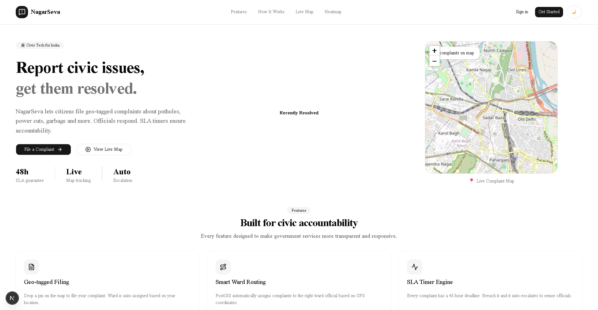
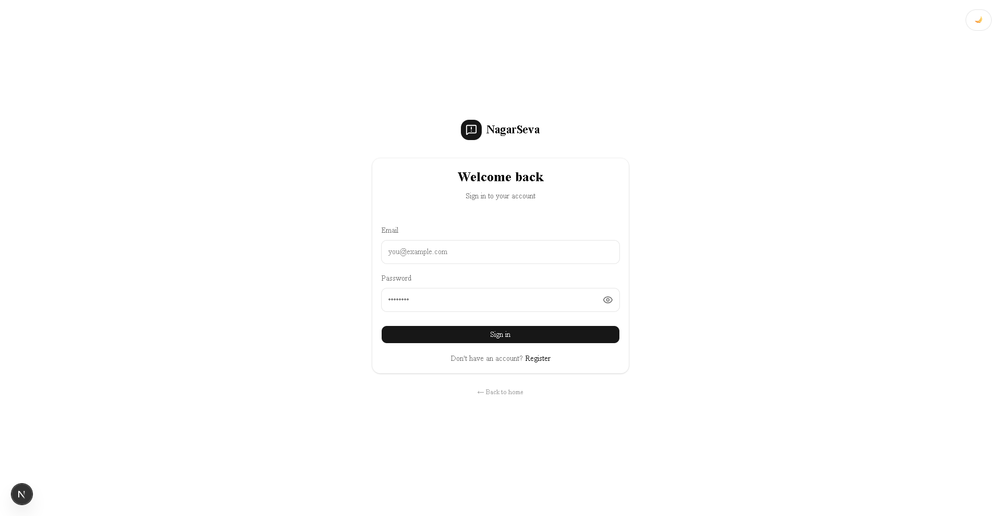
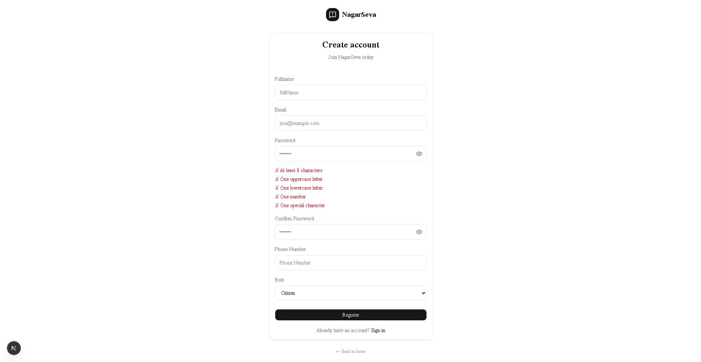
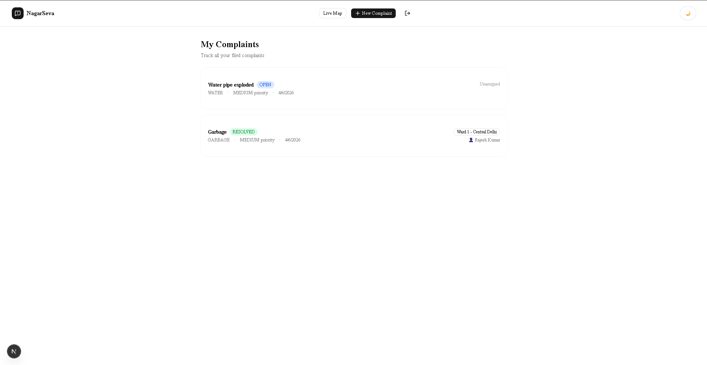
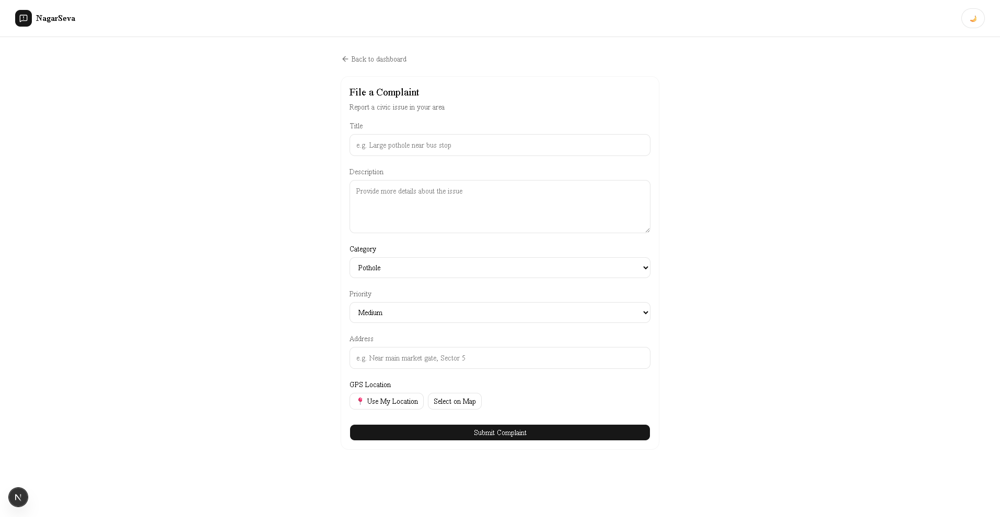
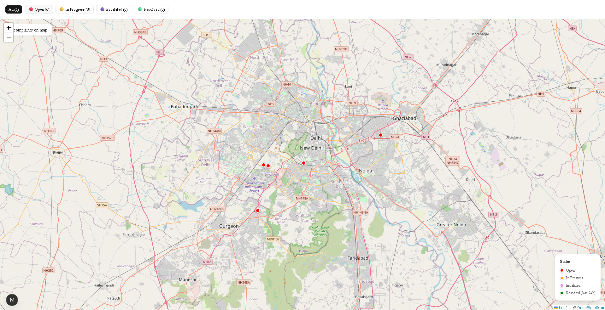
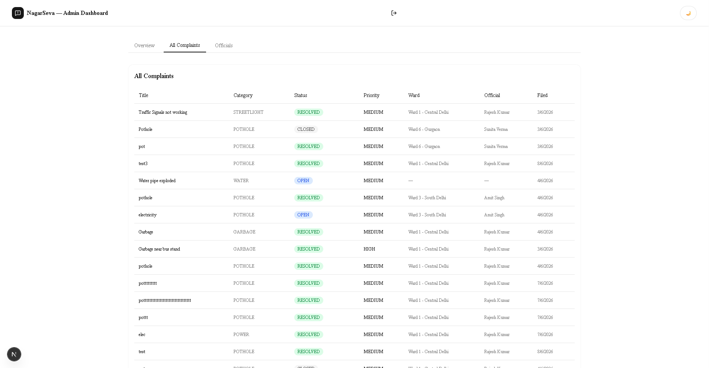
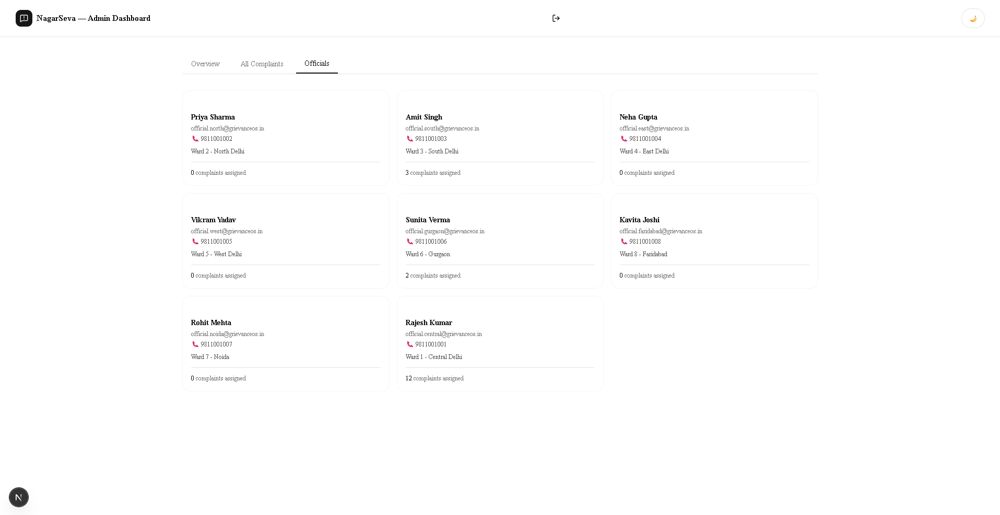

# NagarSeva 🏛️

A full-stack civic complaint resolution platform for Indian municipalities.
Citizens file geo-tagged complaints, officials respond, and SLA timers ensure accountability.

## 🔗 Repositories

| Part | Stack | Folder |
|------|-------|--------|
| Backend | Spring Boot · PostgreSQL + PostGIS · Redis | `/NagarSeva-backend` |
| Frontend | Next.js · TypeScript · Tailwind · Leaflet | `/NagarSeva-frontend` |

## ✨ Key Features

- **Geo-tagged complaints** — PostGIS auto-assigns complaints to the correct ward via GPS
- **Redis SLA engine** — 48h TTL keys auto-escalate breached complaints
- **Live map** — Real-time Leaflet map with color-coded complaint pins
- **Role-based access** — Citizen / Official / Admin with JWT auth
- **Status history** — Full audit trail of every status change
- **WebSocket updates** — Citizens get live notifications on status change

## 🛠️ Tech Stack

**Backend** — Java 21 · Spring Boot 4 · PostgreSQL 18 + PostGIS · Redis · Flyway · Docker

**Frontend** — Next.js 16 · TypeScript · Tailwind CSS · shadcn/ui · Leaflet · Axios

## Screenshots

### Home Page



---

### Login



---

### Registration



---

### Citizen Dashboard



---

### File Complaint



---

### Map View



---

### Admin Dashboard



---

### Admin Dashboard with official's profile



## 🚀 Quick Start

```bash
# Backend
cd NagarSeva-backend
cp src/main/resources/application.properties.example src/main/resources/application.properties
./mvnw spring-boot:run

# Frontend
cd NagarSeva-frontend
npm install
npm run dev
```

Open `http://localhost:3000`
