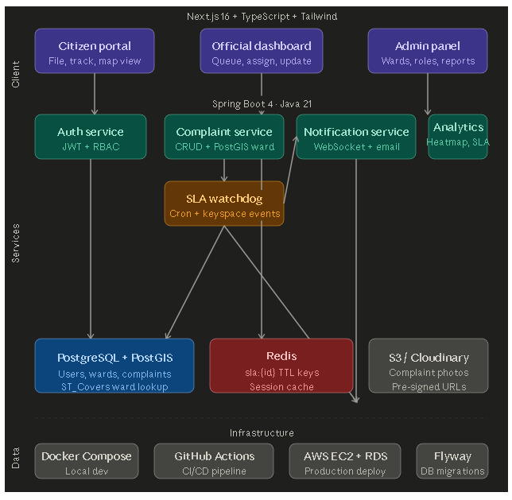

# GrievanceOS

A full-stack civic complaint resolution platform built for Indian municipalities.
Citizens file geo-tagged complaints, officials respond, and SLA timers ensure accountability.

## 🏗️ Architecture



## 🛠️ Tech Stack

**Backend**
- Java 21 + Spring Boot 4
- PostgreSQL 18 + PostGIS (geospatial queries)
- Redis (SLA timer engine with keyspace notifications)
- JWT authentication with RBAC (Citizen / Official / Admin)
- Flyway database migrations
- Docker + GitHub Actions CI/CD

**Frontend**
- Next.js 16 + TypeScript
- Tailwind CSS + shadcn/ui
- Leaflet + React-Leaflet (interactive maps)
- Axios

## ✨ Key Features

- **Geo-tagged complaints** — PostGIS `ST_Covers` query auto-assigns complaints to the correct ward based on GPS coordinates
- **Redis SLA engine** — TTL keys trigger auto-escalation when 48h deadline is breached
- **Live map** — Real-time complaint map with color-coded status pins
- **Role-based access** — Citizens file complaints, Officials manage queues, Admins oversee all
- **Status history** — Full audit trail of every status change

## 🚀 Running Locally

### Prerequisites
- Java 21
- PostgreSQL 18 with PostGIS extension
- Redis (Docker: `docker run -d --name redis -p 6379:6379 redis`)
- Node.js 18+

### Backend
```bash
# Clone and configure
git clone https://github.com/Avin0kk/GrievanceOS
cd grievance-backend
cp src/main/resources/application.properties.example src/main/resources/application.properties
# Fill in your DB credentials

# Run
./mvnw spring-boot:run
```

### Frontend
```bash
cd grievance-frontend
npm install
npm run dev
```

Open `http://localhost:3000`

## 📁 Project Structure